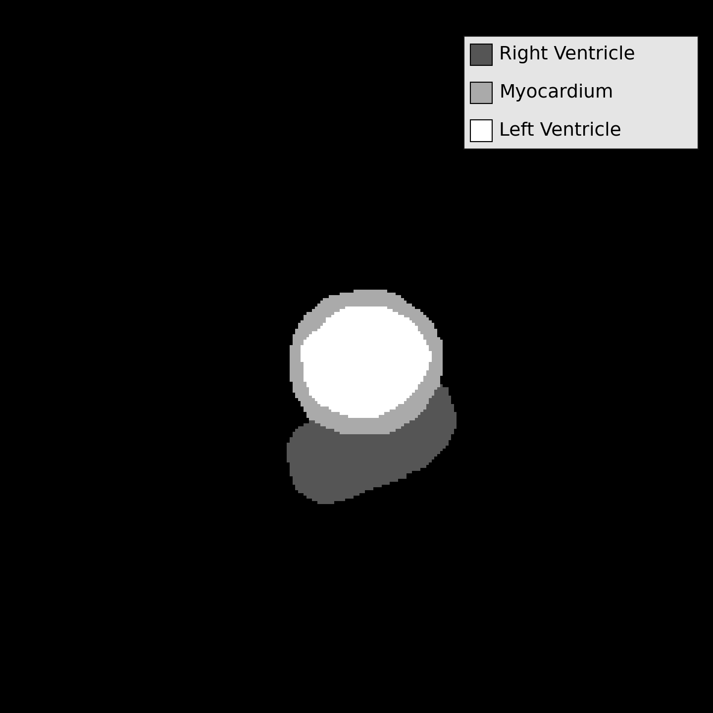
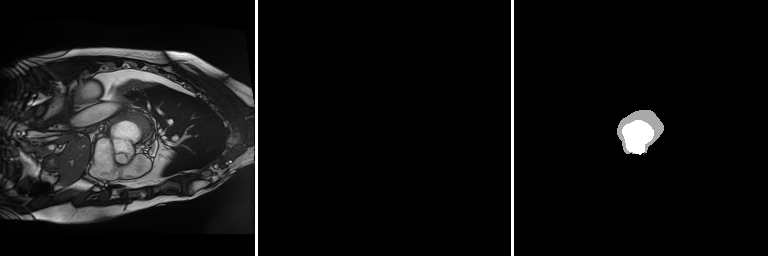
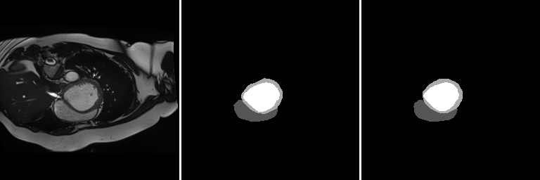

# Medical Segmentation on ACDC Dataset

## Dataset presentation

This project focuses on developing a Deep Learning model for medical image segmentation.
Specifically, it leverages the Automated Cardiac Diagnosis Challenge (ACDC) dataset, which provides cine-MRI images of the heart. Each case in the dataset is manually annotated by clinical experts, highlighting three key cardiac structures:

- Left Ventricle (LV)
- Right Ventricle (RV)
- Myocardium (Myo)

The goal of this work is to automatically segment these regions of interest, which are critical for assessing cardiac function and detecting potential pathologies.

Below is an example of the dataset, including MRI images alongside their corresponding ground-truth annotations.

<table>
  <tr>
    <td align="center">
       
      MRI Image
    </td>
    <td align="center">
       
      Ground Truth
    </td>
  </tr>
  <tr>
    <td align="center">
       
      MRI Image
    </td>
    <td align="center">
       
      Ground Truth
    </td>
  </tr>
</table>

The dataset includes 204 labeled images and 1004 unlabeled images. For this project, only the labeled images are used, focusing on supervised learning. To expand the dataset, data augmentation was applied by performing horizontal and vertical flips, increasing the total number of images from 204 to 612.

## Model Architecture

The model used is an enhanced version of the U-Net, called Attention U-Net, which is widely applied in medical image segmentation.
It is structured into four main parts: the encoder, the bottleneck, the decoder, and the final output layer.

1. **Encoder**

The encoder consists of a sequence of convolutional blocks (conv_block), each containing two convolutional layers followed by Batch Normalization and ReLU activation.
After each block, a MaxPooling operation reduces the spatial resolution by half while increasing the number of feature channels (from 16 → 32 → 64 → 128 → 256).
This path progressively captures more complex features while compressing spatial information.

2. **Bottleneck**

At the deepest level, the network has a convolutional block with 256 channels.
This stage captures high-level semantic features and the global context of the image.

3. **Decoder**

The decoder progressively reconstructs the segmentation map. Each stage starts with an upsampling operation (up_conv) that doubles the spatial resolution and reduces the number of channels.
Skip connections from the encoder are integrated, but before concatenation, they pass through an attention block (Attention_block).
These attention gates learn to emphasize relevant regions while suppressing irrelevant information.
After concatenation, a convolutional block refines the combined features.

4. **Output Layer**

Finally, a 1x1 convolution reduces the number of channels to match the desired output (output_ch=1 in this project).
This produces the final segmentation map.

A diagram illustrating the architecture of the Attention U-Net is provided below.

  

**Why use Attention U-Net instead of classic U-Net?**

Unlike the standard U-Net, the Attention U-Net introduces attention gates in the skip connections.
These gates filter the encoder features before passing them to the decoder.
They allow the model to focus on anatomically relevant regions (e.g., ventricles, myocardium) while ignoring irrelevant background.
This leads to sharper boundaries and improved robustness in medical image segmentation.

## Results

The performance of the model is evaluated using the Dice score, Average Surface Distance (ASD), and Hausdorff Distance (HD), providing a comprehensive assessment of the segmentation accuracy.

Here is a table summarizing the results obtained for each metric and each class.

| Metric | RV    |  Myo  |  LV  | Mean |
|:------:|:-----:|:-----:|:----:|:----:|
| Dice   | 0.59  | 0.78  | 0.86 | 0.74 |
| HD     | 13.92 | 5.97  | 4.67 | 8.19 |
| ASD    | 3.16  | 1.76  | 1.65 | 2.19 |

It can be observed that the model performs worse at segmenting the right ventricle compared to the left ventricle or the myocardium. This is because some images in the dataset contain a left ventricle and myocardium but no right ventricle, as illustrated in the example below. As a result, it is more difficult for the model to learn to recognize a structure that is less frequently present, which explains the difference in performance.

<table>
  <tr>
    <td align="center">
       
      MRI Image
    </td>
    <td align="center">
       
      Ground Truth
    </td>
  </tr>
</table>
 

Another challenging case for the model occurs when there is nothing to detect (none of the three classes are visible in the image) or when the target regions are very small. In the case where there is nothing to detect, the model may predict regions that do not actually exist, and when the regions are too small, it often fails to detect them. Two examples illustrating these cases are shown below.

  

  Left: MRI Image &nbsp;&nbsp;&nbsp;&nbsp;&nbsp;&nbsp;&nbsp;&nbsp;&nbsp;&nbsp;|&nbsp;&nbsp;&nbsp;&nbsp;&nbsp;&nbsp;&nbsp;&nbsp;&nbsp;&nbsp; Middle: Ground Truth &nbsp;&nbsp;&nbsp;&nbsp;&nbsp;&nbsp;&nbsp;&nbsp;&nbsp;&nbsp;|&nbsp;&nbsp;&nbsp;&nbsp;&nbsp;&nbsp;&nbsp;&nbsp;&nbsp;&nbsp; Right: Prediction

  <b>Case where there is nothing to detect</b>

 

  

  Left: MRI Image &nbsp;&nbsp;&nbsp;&nbsp;&nbsp;&nbsp;&nbsp;&nbsp;&nbsp;&nbsp;|&nbsp;&nbsp;&nbsp;&nbsp;&nbsp;&nbsp;&nbsp;&nbsp;&nbsp;&nbsp; Middle: Ground Truth &nbsp;&nbsp;&nbsp;&nbsp;&nbsp;&nbsp;&nbsp;&nbsp;&nbsp;&nbsp;|&nbsp;&nbsp;&nbsp;&nbsp;&nbsp;&nbsp;&nbsp;&nbsp;&nbsp;&nbsp; Right: Prediction

  <b>Case where regions to detect are small</b>

 

As additional examples, here are two more qualitative cases illustrating the model’s performance through visual inspection, rather than quantitative metrics.

  

  Left: MRI Image &nbsp;&nbsp;&nbsp;&nbsp;&nbsp;&nbsp;&nbsp;&nbsp;&nbsp;&nbsp;|&nbsp;&nbsp;&nbsp;&nbsp;&nbsp;&nbsp;&nbsp;&nbsp;&nbsp;&nbsp; Middle: Ground Truth &nbsp;&nbsp;&nbsp;&nbsp;&nbsp;&nbsp;&nbsp;&nbsp;&nbsp;&nbsp;|&nbsp;&nbsp;&nbsp;&nbsp;&nbsp;&nbsp;&nbsp;&nbsp;&nbsp;&nbsp; Right: Prediction

 

  

  Left: MRI Image &nbsp;&nbsp;&nbsp;&nbsp;&nbsp;&nbsp;&nbsp;&nbsp;&nbsp;&nbsp;|&nbsp;&nbsp;&nbsp;&nbsp;&nbsp;&nbsp;&nbsp;&nbsp;&nbsp;&nbsp; Middle: Ground Truth &nbsp;&nbsp;&nbsp;&nbsp;&nbsp;&nbsp;&nbsp;&nbsp;&nbsp;&nbsp;|&nbsp;&nbsp;&nbsp;&nbsp;&nbsp;&nbsp;&nbsp;&nbsp;&nbsp;&nbsp; Right: Prediction

## Conclusion 

In conclusion, this project demonstrates that the Attention U-Net model is able to accurately segment most of the cardiac structures in the dataset. Both quantitative metrics and qualitative examples confirm its performance. However, the model is less precise for rare cases or very small structures, such as precised before. Future improvements could include expanding the dataset, by applying more advanced data augmentation techniques, or exploring more sophisticated architectures to enhance segmentation accuracy.
